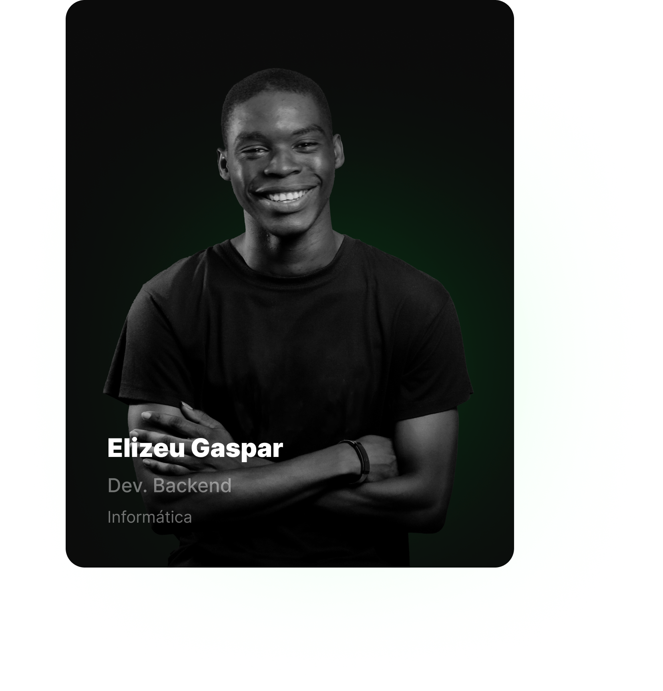

## Olá rede! Meu nome é **Eliseu Gaspar**!

---

<em>

    <h3></h3>
    <h4>Estou no mundo das TI's desde 2021 Dezembro, e desde lá venho estudando muito sobre programação. A possibiidade de criar soluções para resolver determinados problemas e a possibilidade de criar quase tudo o que eu quero só com um computador e conhecimento me é fascinante e isso é umas das coisas que me motiva a estudar!</h4>
    <h4>Abaixo há mais informações sobre mim na área da TI:</h4>
    <ul>
    	<li>Área de Foco: <b>Programação.</b></li>
    	<li>Sub-Área: <b>Desenvolvimento de Softwares.</b></li>
    	<li>Linguagem Predileta: <b>Python.</b></li>
    	<li>Dominando: <b>[Python(Django, Flask, FastAPI), Javascript(Express, React)].</b></li>
    	<li>Aprendendo: <b>[Golang].</b></li>
    	<li>Nacionalidade: <b>Angolana.</b></li>
    </ul>

</em>

### Minha Stack para Trabalho:
&nbsp;
&nbsp;
&nbsp;
&nbsp;
&nbsp;
&nbsp;
&nbsp;
&nbsp;
&nbsp;
&nbsp;
&nbsp;
&nbsp;
&nbsp;
&nbsp;
&nbsp;

---

 

### Minhas análises GitHub:

### Contacte-me nas outras redes

