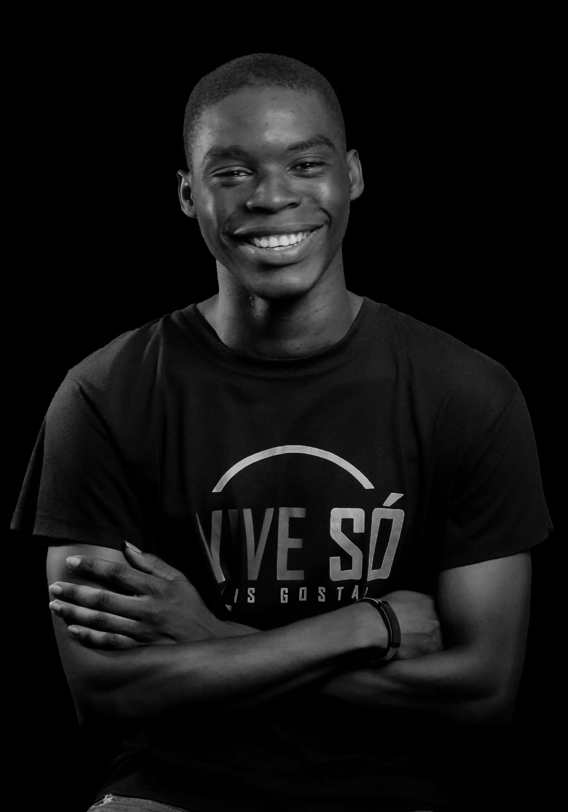

## Olá rede meu nome é **Eliseu Gaspar**!

---

    

        
    

    

    	<h3></h3>
    	<h4>Estou no mundo das TI's desde 2021 Dezembro, e desde lá venho estudando muito sobre programação. A possibiidade de criar soluções para resolver determinados problemas e a possibilidade de criar quase tudo o que eu quero só com um computador e conhecimento me é fascinante e isso é umas das coisas que me motiva a estudar!</h4>
    	<h4>Abaixo há mais informações sobre mim na área da TI:</h4>
    	<ul>
    		<li>Nível Académico: <b>Ensino Médio.</b></li>
    		<li>Área de Foco: <b>Programação.</b></li>
    		<li>Sub-Área: <b>Desenvolvimento de Softwares.</b></li>
    		<li>Linguagem Predileta: <b>Python.</b></li>
    		<li>Linguagens Em Domínio: <b>[Python, Javascript].</b></li>
    		<li>Linguagens Em Learn: <b>[Golang].</b></li>
    		<li>Nacionalidade: <b>Angolana.</b></li>
    		<li>Idade: <b>18.</b></li>
    	<ul>
    

